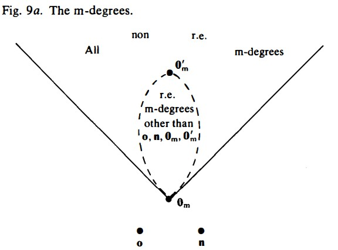

# Reducibility and degrees
two ways of making the idea of reducibility precise, and for each we discuss the associated notion of degree (of difficulty) that arises
deal with reducibility between **sets** rather than between problems, because any problem is represented by a set of numbers
a set A being reducible to a set B can be expressed in various ways: for instance:
* (a) Given a decision procedure for the problem '$x\in B$', we can construct one for '$x\in A$';
* (b) For someone who knows all about B, there is a mechanical procedure (that uses his knowledge of B) for deciding questions about A;
* (c) Questions about A are no harder than questions about B;
* (d) The degree of difficulty of the problem '$x\in A$' is no greater than that of the problem '$x\in B$ '

 In 1-3 we shall investigate one of the simplest notions of reducibility, called **many-one reducibility**, in final section we will discuss more general notion known as #Turing-reducibility.
 ## Many-one reducibility
##### Definition 1.1: #m-reducible
The set A is **many-one reducible** (abbreviated **m-reducible**) to the set B if there is a total computable function f such that for all x: $$x\in A\; iff \;f(x)\in B$$
We write this as $f:A\leq_m B$
If the function f is injective, it's called one-one reducibility, and notion is $f:A\leq_1 B$
s-m-n theorem is often needed to establish many-one reducibility

Example 1.2:
1. K is m-reducible to: 
(a) $\{x:\phi_{x}=\textbf{0}\}$ [theorem 6.1.4](Chapter6.md); 
(b) $\{x:c\in W_x\}$ [theorem 6.1.6](Chapter6.md); 
(c) $\{x:\phi_{x}\;is\;total\}$ ^9219ba
2. [Rice' theorem](Chapter6.md): $K\leq_m\{x:\phi_x\in \mathscr{R}\}$, where $\mathscr{R}\neq \emptyset,\mathscr{R}\subset\mathscr{C}_1$ and $f_{\emptyset}\notin \mathscr{R}$;
3. $\{x:\phi_{x}\;is\;total\}\leq_{m}\{x:\phi_{x}=\textbf{0}\}$
Proof: construct computable function and use s-m-n theorem, for example, for 1(a), we set:
$$
\phi_{k(x)}(y)=g(x,y)=\bigg\{\begin{array}{c}0\qquad for \;x\in K\\undefined\quad else\end{array}
$$
then $x\in K\Leftrightarrow k(x)\in \{x:\phi_{x}=\textbf{0}\}$, so $k(x):K\leq_m \{x:\phi_{x}=\textbf{0}\}$;
For 3: $\phi_{k(x)}(y)=g(x,y)=\sigma(\phi_x(y))$;

##### Theorem 1.3
Let A, B, C be sets, then we have:
1. $\leq_m$ is reflexive, and transitive;
2. $A\leq_m B\;iff\;\overline{A}\leq_m\overline{B}$;
3. if A is #recursive and $B\leq_m A$, then B is recursive;
4. if A is r.e. and $B\leq_m A$, then B is r.e.;
5. if A is #productive and $A\leq_m B$, then B is productive;
6. if A is recursive and $B\neq \emptyset,\mathbb{N}$, then $A\leq_m B$;
Proof: for 2: $f:A\leq_m B$, then $f:\overline{A}\leq_m\overline{B}$;
for 3,4: We suppose $f:B\leq_m A$, then $c_B(x)=c_A(f(x))$;

Then we have:
**Corollary 1.4**: Neither of the sets $\{x:\phi_{x}\;is\;total\}$, $\{x:\phi_{x}\;is\;not\;total\}$ is m-reducible to K. 
Proof:

**Unsatisfactory feature**: Exceptional behaviour of the sets $0,\mathbb{N}$ in Theorem 8.1.3, and the sets A and $\overline{A}$ are not necessarily inter-reducible.

**Corollary 1.5**: If A is an r.e. set that is not recursive, then $\overline{A}\nleq_m A$ and $A\nleq_m \overline{A}$.
Proof: Use [[Chapter9#Theorem 8 1 3|TH8.1.3]]

##### Theorem 1.6
Set A is r.e. iff $A\leq_m K$.
Proof: We need to construct $f:A\leq_m K$, set f:
$$
	\phi_{k(x)}(y)=g(x,y)=\bigg\{\begin{array}{c}0\qquad for \;x\in A\\undefined\quad else\end{array}
$$
Then $x\in A\Leftrightarrow k(x)\in K$, f is the function.

So the problem '$x\in K$' is the most difficult partially decidable problem.

###### exercise 1.7
1. show that K m-reducible to:
	(a) $\{x:\phi_x=\textbf{0}\}$; (b)$\{x:x\in E_x\}$;
2. $\{x:\phi_x=\textbf{0}\}\leq_m\{x: \phi_{x}\;is\;total\;and\;constant\}$;
3. $\{x:x\in E_x\}\leq_m\{x:W_x\;is\;infinite\}$
4.  Show that none of sets in 3 is m-reducible to an r.e. set;
5.  Support that A, B are r.e. sets such that $A\cup B=\mathbb{N}$ and $A\cap B\neq \emptyset$. Prove that $A\leq_m A\cap B$.
Proof: 1 use function like Theorem8.1.6; 
For 2 and 3, $x\in A\Rightarrow x\in B$ is obvious, so we need to construct an function to transfer $x\notin A\Rightarrow k(x)\notin B$, so set:
$$
\phi_{k(x)}(y)=g(x,y)=\bigg\{\begin{array}{ll}0&\phi_{x}(y)=0\\
y&\phi_{x}(y)!=0\\
undefined&else\end{array}
$$

## Degrees
equivalence between sets, we have:

##### Definition 9.2.1: #m-equivalent
The set A and B are *many-one equivalent (m-equivalent)* if $A\leq_m B$ and $B\leq_m A$. We write this $A\equiv_m B$
**Theorem 2.2**: The relation $\equiv_m$ is an #equivalence relation.
Proof: reflexive, and transitive
Example 9.2.3:
1. Let c be any number; then $\{x: c\in W_x\}\equiv_m K$;
2.  For every recursive set A other than $\emptyset,\mathbb{N}$, we have $A\equiv_m \overline{A}$;
3.  If A is r.e. but not recursive, then $A\not\equiv\overline{A}$;
4.  $\{x:\phi_{x}\;is\;total\}\equiv_{m}\{x:\phi_{x}=\textbf{0}\}$;
Proof: For 1, we use [[#^9219ba|EG9-1.2]] and [[#Theorem 1 6|TH9-1.6]], for 2 and 3, [[#Theorem 9 1 3|TH9-1.3]]; for 4, 

**Notation**: For any set A, the equivalence class of A under the relation $\equiv_m$ is the class of sets $d_{m}(A)=\{B:A\equiv_{m} B\}$.

##### Definition 2.4: #m-degree
An **m-degree** is an equivalence class of sets under the relation $\equiv_m$; i.e. it is any class of sets of the form $d_m(A)$ for some set A. 
#Question: no meaning to explain it?
It is conventional to use lower case bold face letters such as **a, b, c** to denote degrees.

Let **a, b** be m-degrees.
(a) $\textbf{a}\leq_m \textbf{b}$ if there are $A\in \textbf{a}$ and $B\in \textbf{b}$ such that $A\leq_m B$;
(b) $\textbf{a}<_m \textbf{b}$ if $\textbf{a}\leq_m \textbf{b}$ but $\textbf{a}\neq \textbf{b}$.

##### Theorem 2.6: partial ordering of m-degrees
The relation $<_m$ is a **partial ordering of m-degrees**. 

*recursive m-degree* and *r.e. m-degree*: any m-degree that contains a recursive set/r.e. recursive set.

##### Theorem 2.7
1. $\{\emptyset\}$ and $\{\mathbb{N}\}$ are m-degrees, which we denote by **o** and **n**; respectively; **o** and **n** are recursive m-degrees;
2. There is one other *recursive m-degree*, denoted $\textbf{0}_m$, that consists of all *recursive sets* except $\emptyset$ and $\mathbb{N}$; moreover, $\textbf{0}_m\leq_m \textbf{a}$ for any m-degree **a** other than **o**, **n**;
3. For any m-degree **a**, we have $\textbf{o}\leq_m\textbf{a}$ provided $\textbf{a}\neq\textbf{n}$, and $\textbf{n}\leq_m\textbf{a}$ provided $\textbf{a}\neq\textbf{o}$;
4. Any r.e. m-degree consists only of r.e. sets;
5. If $\textbf{a}\leq_m\textbf{b}$ and **b** is an r.e. m-degree, then **a** is also an r.e. m-degree;
6. There is a **maximum r.e. m-degree**, namely $d_m{K}$, which is denoted $\textbf{0}_m'$.
Proof: For 1-5, use [[#Theorem 1 3|TH9-1.3]], use[[#Theorem 1 6|TH9-1.6]] 

A picture of the m-degrees as shown in fig.9a, we position a degree a below a degree b to indicate that $\textbf{a}\leq_m\textbf{b}$.  The following theorem means that this structure is an upper semi-lattice.

##### Theorem 2.8: m-degree is upper #semit-lattice
Any pair of m-degrees **a, b** have a least upper bound; i.e. there is an m-degree **c** such that:
(i) $\textbf{a}\leq_m\textbf{c}$ and $\textbf{b}\leq_m\textbf{c}$(**c** is an upper bound);
(ii) $\textbf{c}\leq_m\textbf{d}$, **d** is any upper bound of **a, b**;
Proof: Construct this least upper bound: $A\oplus B$

Also, we have following observations:
* There is a minimum m-degree $\textbf{0}_m$(except **o** and **n**);
* the r.e. m-degrees form an **initial segment** of the m-degrees, i.e. anything below an r.e. m-degree is also r.e;
* there is a maximum r.e. m-degree - namely $\textbf{0}_m'$;
* while there are uncountably many m-degrees, only **countably** many of these are r.e.;

The structure of the r.e. m-degrees is exceedingly complex.

###### Exercises 9.2.9
1. Show the following sets are $\equiv_m K$:
	(a) $\{x:x\in E_x\}$; (b) $\{x:\phi_x(x)=0\}$;
2. Prove that:
	(a) for any set A, $A\equiv_m A\otimes\mathbb{N}$; 
	(b) Let B be a non-empty recursive set. Show that $A\equiv_m A\otimes B$ for any $A\neq \mathbb{N}$;
3. Is it true that if $A\equiv_m\overline{A}$, then A is recursive?
4. Show that the following sets are in the same m-degree:
	(a) $\{x:\phi_x=\textbf{0}\}$;
	(b) $\{x:\phi_x is total and constant\}$;
	(c) $\{x:W_x is infinite\}$;
5. Let a,b be m-degrees:
	(a) Show that the least upper bound is uniquely determined, and we denote this by $\textbf{a}\cup\textbf{b}$;
	(b) Show that if $\textbf{a}\leq_m\textbf{b}$, then $\textbf{a}\cup\textbf{b}=textbf{b}$;
	(c) Show that if a,b are r.e., then so is $\textbf{a}\cup\textbf{b}$;
	(d) Let $A\in\textbf{a}$ and let $\textbf{a}^*$ denote $d_m(\overline{A})$, show that $(\textbf{a}\cup\textbf{a}^*)^*=\textbf{a}\cup\textbf{a}^*$;
6. =========

Proof: For 1 ,use A is r.e., and $k\leq_m A$ has been proved previously;For 2, we use $k(x)=x\otimes y, y\in\mathbb{N} or\;y\in B$; For 3, ????; For 4, $A_a\equiv A_b$ have been proved previously, and using the same step, (c) is obvious; For 5, 

## m-complete r.e. sets
As shown in TH9-2.7, $\textbf{0}_m'=d_m(K)$ is the maximum among all r.e. degrees, it's also saying that the set K is an **m-complete r.e. set**.
##### Definition 9.3.1: #m-complete
A set is **m-complete** if it is r.e. and any r.e. set is m-reducible to it.
##### Theorem 3.2: K is m-complete
(a) K is m-complete;
(b) A is m-complete iff $A\equiv_m K$ iff A is r.e. and $K\leq_m A$;
(c) $\textbf{0}_m'$ consists exactly of all m-complete sets.

Examples 9.3.3:
The following sets are m-complete:
(a)$\{x:c\in W_x\}$; 
(b) any non-trival r.e. set of the form$\{x:\phi_x\in\mathscr{R}\}$ where $\mathscr{R}\subseteq\mathscr{C}_1$;
(c) $\{x:\phi_x(x)=0\}$;
(d) $\{s:x\in E_x\}$

##### Theorem 3.4: Any #m-complete set is #creative.
##### Theorem 3.5(Myhill): #Creative sets are #m-complete.
Proof: in [[Chapter11]]

corollary 9.3.6: #Simple_sets are not m-complete, hence if a is the m-degree of any simple set, then $\textbf{0}<_m\textbf{a}<_m\textbf{0}_m'$.

So there is something between $\textbf{0}_m$ and $\textbf{0}_m'$ if fig.9a.
It is beyond the scope of this book to investigate further the structure of the m-degrees under their partial ordering $\leq_m$

## Relative computability
#M-reducibility has two rather unsatisfactory features:
(a) the exceptional behaviour of $\emptyset$ and $\mathbb{N}$;
(b) the fact that we do not always have $A\equiv_m \overline{A}$.

The ideal of #Turing-reducibility is that '$x\in A$' can be settled in a mechanical way by answering several questions about B which are not necessarily known in advance.
This idea is made precise in terms of #relative-computability
$\chi$ is any total unary function, we say that a function **f is computable relative to $\chi$, or $\chi$-computable**, if f can be computed by an effective algorithm in the usual sense, we are allowed access to values of the function $\chi$, this algorithm is called a **$\chi$-algorithm**.
$\chi$-algorithm as being linked to some external agent or **oracle** that can supply values of $\chi$ on demand.
##### Definition 4.1: URMO
The URMO is an URM with a fifth kind of instruction O(n) for every $n\geq 1$. 
**oracle instruction** O(n): if $\chi$ is in the oracle, then replace $r_n$ (the contents of register $R_n$) by $\chi(r_n)$.

URMO must be linked to an oracle, which supplies values of some given function $\chi$ on demand.
In a URMO program P, no particular function $\chi$ is mentioned.
we write $P^{\chi}$ to denote the program P when used with the function $\chi$ in the oracle; 
$P^{\chi}(a_1,\dots,a_n)$ for the computation by P; 
$P^{\chi}(\textbf{a})\downarrow b$: mean that the computation $P^{\chi}$ stops with the number b;

##### Definition 4.2: #URMO-computable 
Let $\chi$ be a unary total function, and suppose that f is a partial 
function from $\mathbb{N}^{n}$ to $\mathbb{N}$.
(a) Let P be a URMO program. Then **P URMO-computes f 
relative to $\chi$** (or **f is $\chi$-computed by P**) if for every $a\in\mathbb{N}^{n}$ and $b\in\mathbb{N}$:
$P^{\chi}(\textbf{a})\downarrow b$   iff   $f(\textbf{a})\simeq b$;
(b) The function **f is URMO-computable relative to $\chi$** (or just $\chi$-computable) if there is a URMO program that URMO-computes it relative to $\chi$.

$\mathscr{C}^{\chi}$: the class of all $\chi$-computable functions
We shall first outline a little of the development of the theory of relative computability.

##### Theorem 4.3
1. $\chi\in \mathscr{C}^{\chi}$;
2. $\mathscr{C}\in \mathscr{C}^{\chi}$;
3. If $\chi$ is computable, then $\mathscr{C}=\mathscr{C}^{\chi}$;
4. $\mathscr{C}^{\chi}$ is closed under substitution, recursion, and minimalisation;
5. If $\psi$ is a total unary function that is $\chi$-computable, then $\mathscr{C}^{\psi}\subset\mathscr{C}^{\chi}$;

Proof: 1,2 is obvious, For 3, we use the URM which compute $\chi$ to compute O(n); For 4 , as proved previously; For 5, like 3.

### Other approaches to relative computability
##### Definition 4.4: $\chi$-partial recursive functions

##### Theorem 4.5: For any $\chi$, $\mathscr{R}^{\chi}=\mathscr{C}^{\chi}$

**Numbering programs and functions**: URMO programs can be 
effectively numbered or coded by an easy adaptation of the method used in chapter 4 for URM programs, so that we have a fixed effective enumeration (without repetitions):
> $Q_0,Q_1,Q_2,\dots$ of all URMO programs

Then we write:
* $\phi^{\chi,n}_{m}$ for the n-ary function $\chi$-computed by $Q_m$;
* $\phi^{\chi}_{m}$=$\phi^{\chi,1}_{m}$;
* $W^{\chi}_{m}=Dom(\phi^{\chi}_{m})$;
* $E^{\chi}_{m}=Ran(\phi^{\chi}_{m})$;

##### Theorem 4.6: relativised s-m-n theorem
For each $m,n\geq 1$ there is a total computable $(m+1)$-ary function $s^{m}_n(\textbf{e},textbf{x})$such that for any x:
> $\phi^{\chi,(m+n)}_{e}(\textbf{x},\textbf{y})\simeq\phi^{\chi,n}_{s^{m}_n(\textbf{e},\textbf{x})}(\textbf{y})$

that $s^{m}_n(\textbf{e},\textbf{x})$ here is still computable (not merely $\chi$-computable) and does not depend on $\chi$.

**Universal programs for relative computability**

##### Definition 4.8: $\chi$-recursive and $\chi$-r.e. sets
Let A be a set:
(a) A is $\chi$-recursive if $c_{A}$ is $\chi$-computable;
(b) A is $\chi$-r.e. if the partial characteristic function
$$
f(x)=\bigg\{\begin{array}{ll}1&if\;x\in A,\\
undefined &if\;x\notin A\end{array}
$$
is $\chi$-computable.
The following selection of basic results about $\chi$-recursive and $\chi$-r .e. sets is proved by the addition of the prefix $\chi$- at the appropriate places in the proofs of the corresponding unrelativised results in chapter 7:

##### Theorem 4.9
1. For any set A, A is x-recursive iff A and $\overline{A}$ are x-r.e.;
2. For any set A, the following are equivalent:
	(i) A is $\chi$-r.e.; 
	(ii) $A=W^{x}_m$ for some m; 
	(iii) $A=E^{x}_{m}$ for some m;
	(iv) $A=\emptyset$ or A is the range of a total $\chi$-computable function;
	(v) for some $\chi$-decidable predicated R(x,y), $x\in A\Leftrightarrow \exists y\;R(x,y)$;
3. Let $K^{\chi}={x: x\in W^{\chi}_x}$, then $K^{\chi}$ is $\chi$-r.e. but not $\chi$-recursive.

**Computability relative to a set**: For any set A, we define computability relative to A (or just #A-computability) to mean computability relative to $c_{A}$, the characteristic function of A.
###### Exercises 4.10

===================
## Turing reducibility and Turing degrees

##### Definitions 5.1: #Turing-reducible and #Turing-equivalent
(a) The set A is Turing reducible (or just #T-reducible) to the set 
B if A is B-recursive (equivalently, if $c_A$ is B-computable). This is written $A\leq_T B$;
(b) The sets A, B are Turing equivalent (or #T-equivalent) if $A\leq_T B$ and $B\leq_T A$.  We write this $A\equiv_T B$.

##### Theorem 5.2: Properties of $\leq_T$ and $\equiv_T$
1. $\leq_T$ is reflexive and transitive;
2. $\equiv_T$ is an equivalence realtion;
3. if $A\leq_m B$ then $A\leq_T B$;
4. $A\equiv_T\overline{A}$ for all A;
5. if $A$ is recursive, then $A\leq_T B$ for all B;
6. if  $A$ is recursive, and $B\leq_T A$, then B is recursive;
7. if A is r.e., then $A\leq_T K$;

Proof: 1 and 2 are obvious, for 3, suppose that $f:A\leq_m B$, we have f is computable, so we can compute '$x\in A$' by asking '$f(x)\in B$'; for 4, use $c_{\overline{A}}=\lnot C_{A}$; for 5, 
#question :for 3, the reverse theorem is false, can we find a instance?
Remarks: From this theorem we see that #T-reducibility does not 
have the defects of #m-reducibility; And K is a #T-complete (r.e.) set.

##### Definition 5.3: #T-complete (r.e.) set
A set A is T-complete if A is r.e. and $B\leq_T A$ for every r.e. set B.
##### Definition 5.4: #Turing-degree
(a) Let A be a set; the equivalence class $d_T(A)=\{B:B\equiv_T A\}$ is called the Turing degree of A, abbreviated the **T-degree of A**;
(b) Any T-degree containing a recursive set is called a **recursive T-degree**;
(c) Any T-degree containing an r.e. set is called an **r.e. T-degree**;

The term reducible without qualification is often used to mean Turing-reducible; Turing degrees are often referred to merely as 
degrees, or degrees of unsolvability. 
#Turing-reducible is also a partical ordering on Turing-degrees

##### Definition 5.5

##### Theorem 5.6
1. There is a single recursive degree, which is denoted $\textbf{0}$; $\textbf{0}$ consists of all the recursive sets, and is the unique minimum degree;
2. Let $\textbf{0}'$ denote the degree of K; then $\textbf{0}<\textbf{0}'$ and $\textbf{0}'$ s a maximum among all r.e. degrees;
3. For any sets A,B:
	(i) $d_{m}(A)\subset d_{T}(A)$;
	(ii) if $d_{m}(A)\leq_m d_{m}(B)$, then $d_{T}(A)\leq_{T}d_{T}(B)$;

Proof: Using above theorems to prove, obviously.
### #jump-operation
**The jump-operation**: from recursive sets to T-complete sets, we have $\textbf{0}<\textbf{0}'$, We now show that for any degree **a** there is a corresponding step or jump to a higher 
degree **a'**, known as **the jump of a**. 

$K^{A}=\{x:x\in W^{A}_x\}$
##### Theorem 5.7: 
Let A, B be any sets:
1. $K^{A}$ is A-r.e.; if B is A-r.e., then $B\leq_T K^{A}$;
2. if A is recursive, then $K^{A}\equiv_T K$;
3. $A\leq_T K^{A}$;
4. If $A\leq_T B$, then $K^{A}\leq_T K^{B}$; If $A\equiv_T B$, then $K^{A}\equiv_T K^{B}$; 

##### Definition 5.8: the jump of a
For any degree **a**, **the jump of a**, denoted a' , is the degree of $K^{A}$ for any $A\in\textbf{a}$.

##### Theorem 5.9
For any degrees **a, b**:
1. $\textbf{a}<\textbf{a}'$;
2. if $\textbf{a}<\textbf{b}$, then $\textbf{a}''<\textbf{b}'$;
3. if $B\in \textbf{b},A\in \textbf{a}$ and B is A-r.e., then $\textbf{b}\leq \textbf{a}'$;

Proof: By [[#Theorem 5.7|TH9-5.7]]

##### Theorem 5.10
Any degrees a, b have a unique least upper bound. 

the structure of the r.e. degrees **do not** form an initial segment of the #Turing-degrees, as was the case with the r.e. m-degrees.
It is now known that the structure of the T-degrees and the 
r.e. T-degrees is extremely rich and complex.

### Post's problem
> Is there an r.e. degree a such that $\textbf{0}<\textbf{a}<\textbf{0}'$?

For m-degrees, post have a single set between K and $\textbf{0}$, but according to the result of Dekker, $\textbf{0}'$ contains a simple set. 

##### Theorem 5.12
Any non-recursive r.e. degree contains a simple set.

Proof: Let B be an r.e. set that is not recursive, and let $B=Ran(f)$ where f is a total injective computable function([[Chapter7#exercise 2.18(7)|EC7-2.18(7)]]), let A be the set given by:$A=\{x:\exists y(y>x)\;and\;f(y)<f(x)\}$;
In [[Chapter7#exercise 4.4(2)|EC7-4.4(2)]], the hint that A is simple. Then we prove that $A\equiv_T B$.

This theorem underlines the difference between #m-degrees and #T-degrees, since it shows that $\textbf{0}'$, unlike $\textbf{0}'_m$, contains many r.e. sets that are not m-complete. 

##### Theorem 5.13: Friedberg-Muchnik theorem
There are r.e. sets A, B such that $A\nleq_T B$ and $B\nleq_T A$. Hence, if $\textbf{a}$, $\textbf{b}$ are $d_T(A)$, $d_{T}(B)$ respectively, $\textbf{a}\nleq\textbf{b}$ and $\textbf{b}\nleq\textbf{a}$, and thus $\textbf{0}<\textbf{a}<textbf{0}'$ and $\textbf{0}<\textbf{b}<textbf{0}'$.
Degrees $\textbf{a}$, $\textbf{b}$ such that$\textbf{a}\nleq\textbf{b}$ and $\textbf{b}\nleq\textbf{a}$ are called **incomparable degrees**; this is written $\textbf{a}|\textbf{b}$.

There are many results about degrees that, like the Friedberg-Muchnik theorem, are easy to formulate but difficult to prove.
We give below a sample of these, to illustrate the complexity of the #T-degrees.

### Theorem 5.14-5.19
* Theorem 5.14
For any r.e. degree $\textbf{a}>\textbf{0}$, there is an r.e. degree $\textbf{b}$ such that $\textbf{a}|\textbf{b}$.
* Theorem 5.15: Sacks' Density theorem
For any r.e. degrees $\textbf{a}<\textbf{b}$ there is an r.e. degree c with $\textbf{a}<\textbf{b}<\textbf{c}$.
* Sacks' Splitting theorem
For any r.e. degree $\textbf{a}>\textbf{0}$ there are r.e. degrees $\textbf{a}$, $\textbf{b}$ such that 
$\textbf{b}<\textbf{a}$, $\textbf{c}<\textbf{a}$ and $\textbf{a}=\textbf{b}\cup\textbf{c}$, hence $\textbf{b}|\textbf{c}$.
* Theorem 5.17(Lachlan, Yates)
(a) There are r.e. degrees $\textbf{a}$, $\textbf{b}>\textbf{0}$ such that $\textbf{0}$ is the greatest lower bound of $\textbf{a}$ and $\textbf{b}$;
(b) There are r.e. degrees $\textbf{a}$, $\textbf{b}$ having no greatest lower bound (either among all degrees or among r.e. degrees).
* Theorem 5.18(Shoenfield)
There is a non-r.e. degree $\textbf{a}<\textbf{0}'$.
* Theorem 5.19(Spector)
There is a minimal degree. 

For proofs of these and other results about degrees we refer the reader again to the books of Rogers and Shoenfield. The article by Simpson [1977] gives a very readable survey of more recent results that are not included in these books.

**T-degrees and m-degrees**: Often results about T-degrees give information about the structure of the m-degrees almost immediately, via [[#Theorem 5 6|TH9-5.6(3)]].

Corollary 5.20(to theorem 5.14)
For any r.e. m-degree $\textbf{a}>_m \textbf{0}_m$, there is an r.e. m-degree $\textbf{b}$ such that $\textbf{b}|\textbf{a}$.

**Other reducibilities** There are other notions of reducibility that lie between the restricted notion of m-reducibility and the broader T-reducibility.

###### exercise 5.12
1. Show that each of the following set is T-complete:
	(a)$\{x:x\in E_x\}$; (b) $\{x:W_x=\emptyset\}$;
2. Imporve [[#Theorem 5 7|TH9-5.7(4)]] by showing that $A\leq_T B$ iff $K^{A}\leq_m K^{B}$ and $A\equiv_T B$ iff $K^{A}\equiv_m K^{B}$;
3. Show that the previous question can be made effective in the following sense: there is a total computable function f such that for any A, B, if $c_A=\phi^{B}_e$, then $\phi_{f(e)}:K^{A}\leq_m K^{B}$.
4. For  any set A define a sequence of sets $A^{(n)}$ by:
	$A^{(0)}=A$, $A^{(n+1)}=K^{A^{(n)}}$;
	and let $A^{(\omega)}=\{\pi(m,n):m\in A^{(n)}\}$.
	(a) Show that $A^{(n)}<_T A^{(\omega)}$ for all n;
	(b) Show that there is a total computable function h such that $c_{A^{(n)}}=\phi^{A^{(\omega)}}_{h(n)}$ for all n;
	(c) Suppose that B is a set such that $A^{(\omega)}\leq_T B$ for all n in the following strong way: there is a total computable function f such that $c_{A^{(n)}}=\phi^{B}_{f(n)}$ for all n. Show that $A^{(\omega)}|leq_T B$;
	(d)
5. Prove [[#Theorem 5 10|TH9-5.10]].
6. Complete the proof of [[#Theorem 5 12|TH9-5.12]].
7. Prove as a corollary to [[#Theorem 5 14-5 19|TH9-5.17(a)]] that there are r.e. m-degrees such that $\textbf{0}_m$ is the greatest lower bound of a and b.